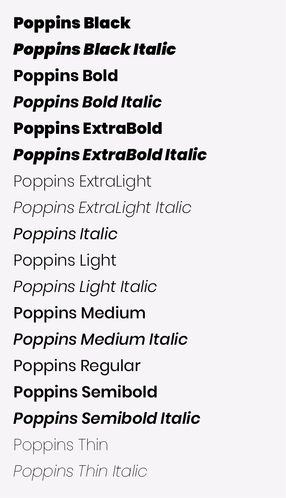

# Poppins



### Downloads

[Poppins-Black.ttf](Poppins/Poppins-Black.ttf)

[Poppins-BlackItalic.ttf](Poppins/Poppins-BlackItalic.ttf)

[Poppins-Bold.ttf](Poppins/Poppins-Bold.ttf)

[Poppins-BoldItalic.ttf](Poppins/Poppins-BoldItalic.ttf)

[Poppins-ExtraBold.ttf](Poppins/Poppins-ExtraBold.ttf)

[Poppins-ExtraBoldItalic.ttf](Poppins/Poppins-ExtraBoldItalic.ttf)

[Poppins-ExtraLight.ttf](Poppins/Poppins-ExtraLight.ttf)

[Poppins-ExtraLightItalic.ttf](Poppins/Poppins-ExtraLightItalic.ttf)

[Poppins-Italic.ttf](Poppins/Poppins-Italic.ttf)

[Poppins-Light.ttf](Poppins/Poppins-Light.ttf)

[Poppins-LightItalic.ttf](Poppins/Poppins-LightItalic.ttf)

[Poppins-Medium.ttf](Poppins/Poppins-Medium.ttf)

[Poppins-MediumItalic.ttf](Poppins/Poppins-MediumItalic.ttf)

[Poppins-Regular.ttf](Poppins/Poppins-Regular.ttf)

[Poppins-SemiBold.ttf](Poppins/Poppins-SemiBold.ttf)

[Poppins-SemiBoldItalic.ttf](Poppins/Poppins-SemiBoldItalic.ttf)

[Poppins-Thin.ttf](Poppins/Poppins-Thin.ttf)

[Poppins-ThinItalic.ttf](Poppins/Poppins-ThinItalic.ttf)

### Web Embed

Copy this code into the `<head>` of your HTML document:

```html
<link href="https://fonts.googleapis.com/css?family=Poppins:300,400,500,700&display=swap" rel="stylesheet">
```

### Downloads

[Poppins.zip](Poppins/Poppins.zip)

# Licensing

Poppins is available as an open source font through [Google Fonts](https://fonts.google.com/specimen/Roboto).
It is licensed under the Apache License, Version 2.0.